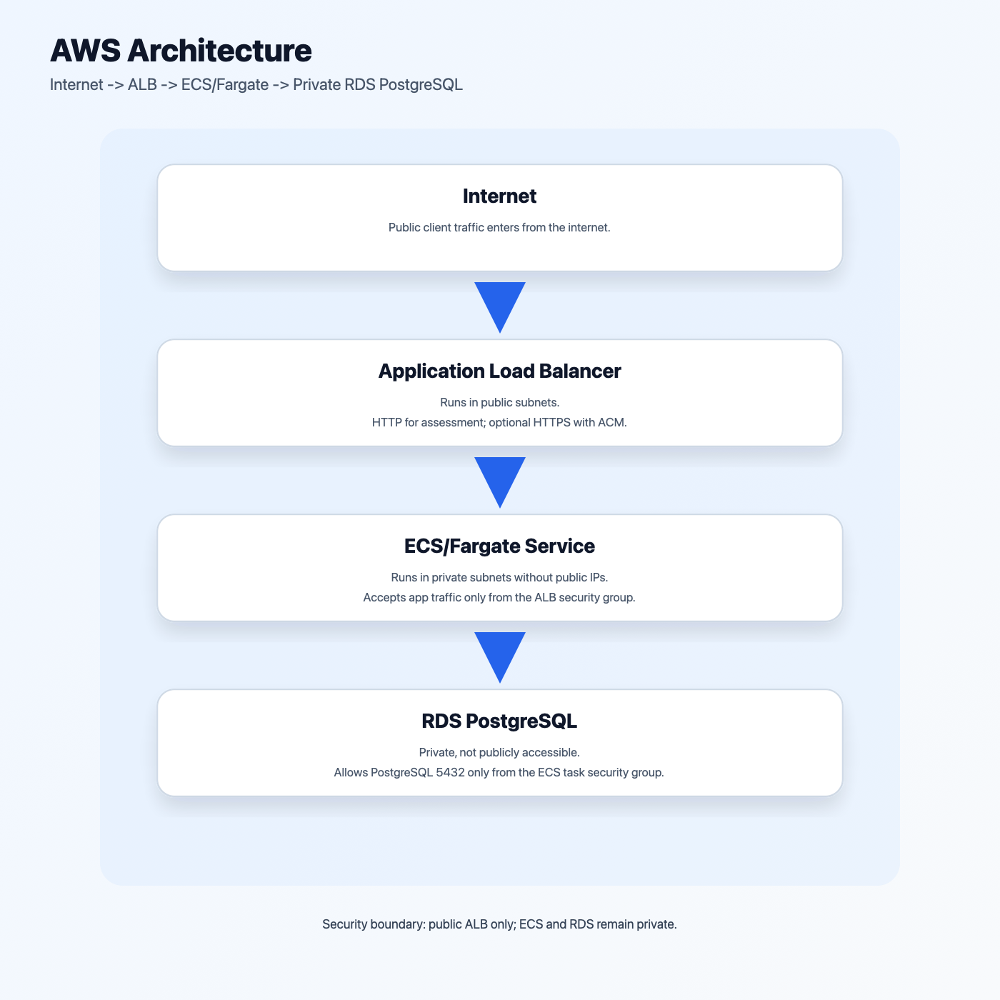
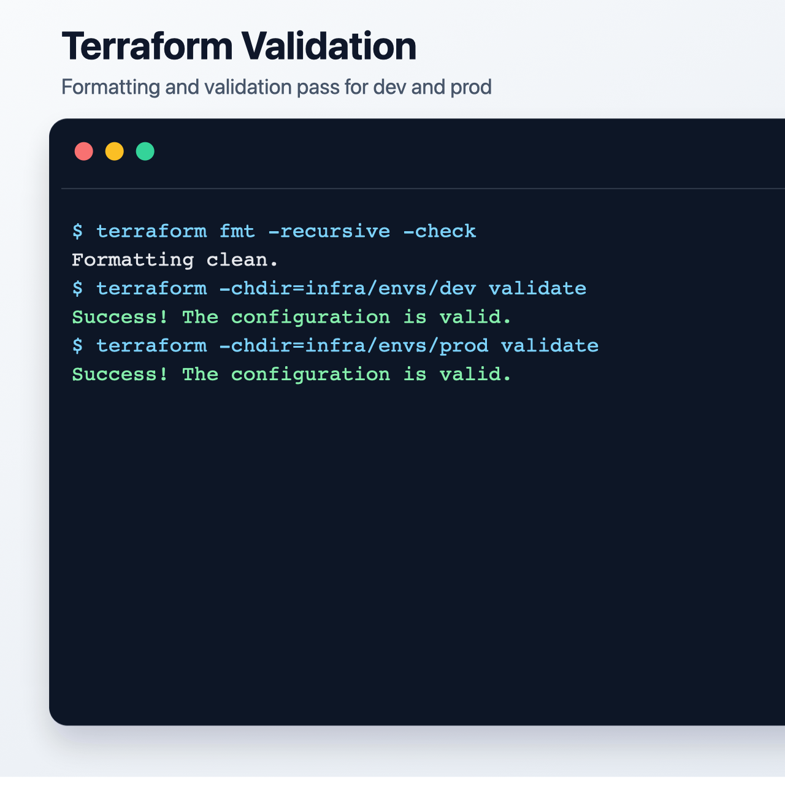
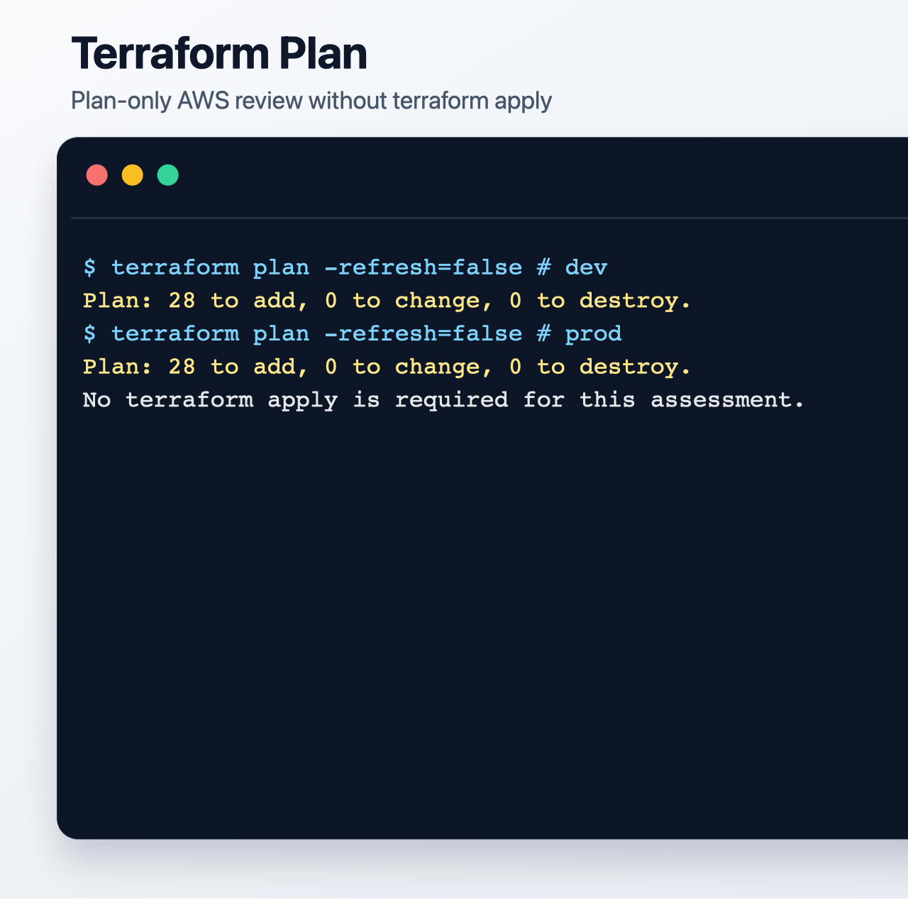
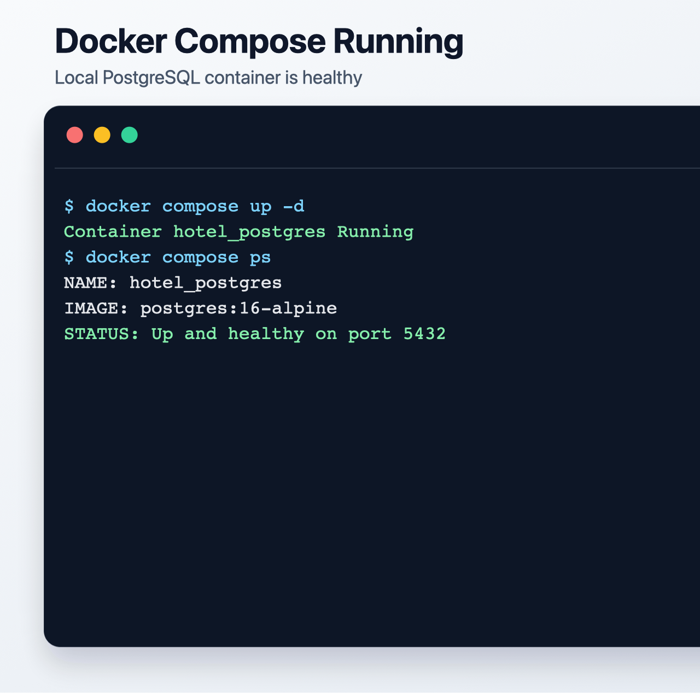
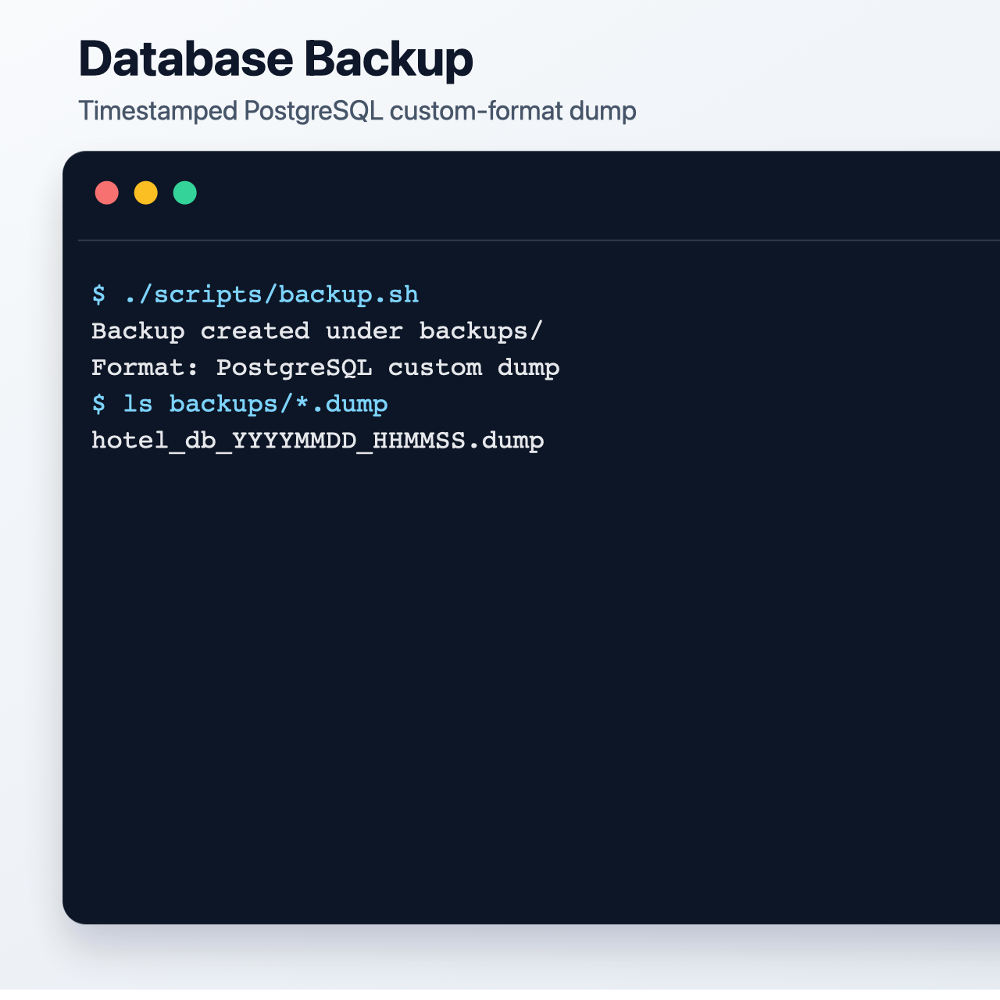
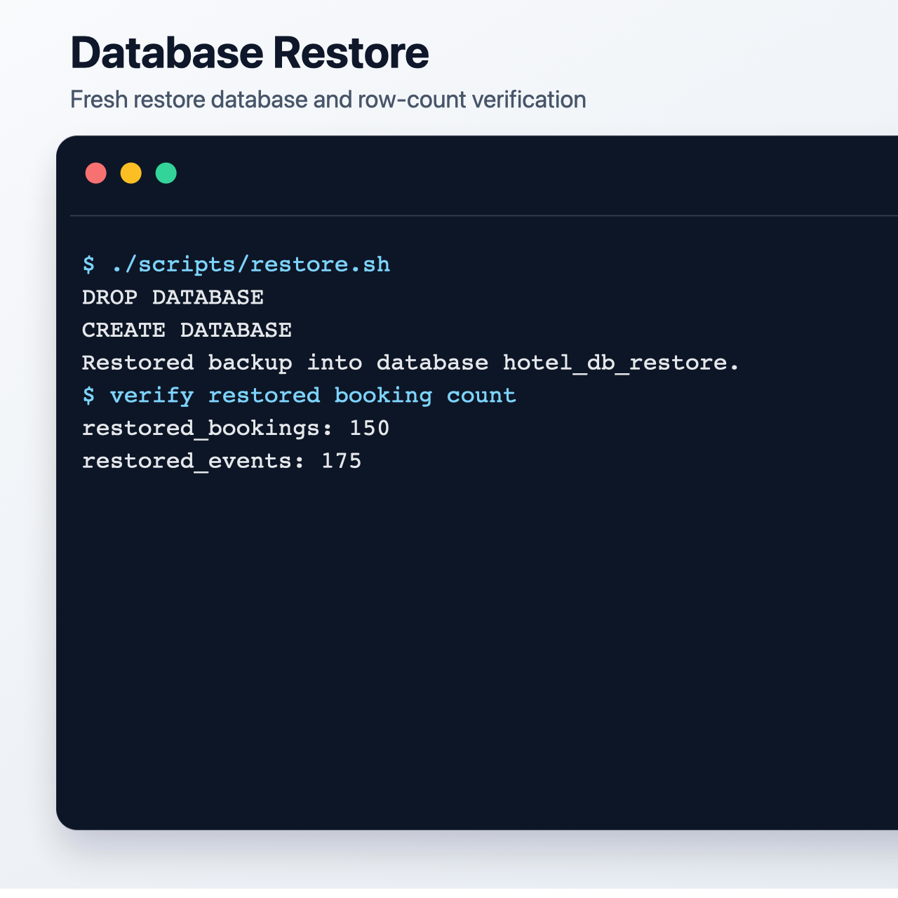
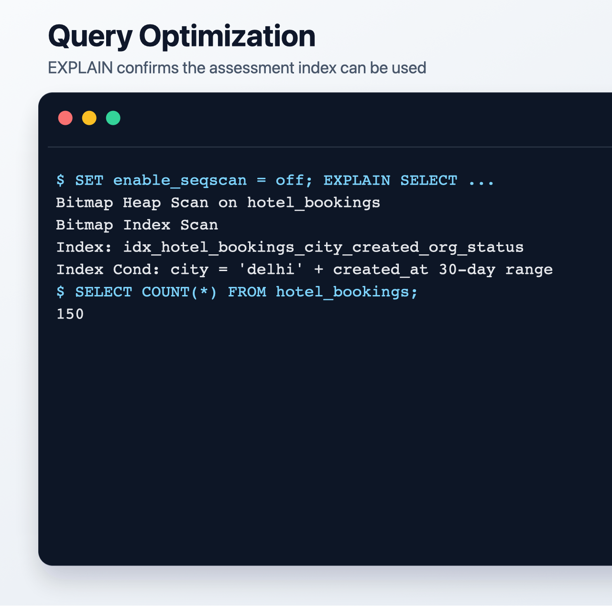

# DevOps Assessment: Terraform + Database Reliability

This repository contains a plan-only AWS infrastructure design and a runnable local PostgreSQL reliability exercise. It is built for review with Terraform formatting, validation, and plan commands plus Docker Compose database backup and restore checks.

Actual AWS deployment is not required and `terraform apply` should not be run for this assessment.

## Architecture

```text
Internet
  |
  v
Public ALB
  |
  v
ECS/Fargate service in private subnets
  |
  v
Private RDS PostgreSQL
```

RDS is placed in private subnets with `publicly_accessible = false`. Its security group allows PostgreSQL on port `5432` only from the ECS task security group, so database access is limited to the application tier.



## Repository Structure

```text
devops-assessment-terraform-db/
├── README.md
├── docker-compose.yml
├── infra/
│   ├── modules/
│   │   ├── network/
│   │   ├── ecs/
│   │   └── rds/
│   └── envs/
│       ├── dev/
│       └── prod/
├── db/
│   ├── migrations/
│   └── seeds/
├── scripts/
│   ├── backup.sh
│   └── restore.sh
├── .github/
    └── workflows/
        └── terraform-plan.yml
```

## Prerequisites

- Terraform 1.6+
- Docker Desktop or Docker Engine with Compose
- Bash
- Git

AWS credentials are not required for the default validation path. The Terraform provider uses mock credentials by default so `terraform plan -refresh=false` can review the design without contacting AWS.

For a real deployment, set `use_mock_aws_credentials = false` and provide credentials through the normal AWS provider chain, such as `AWS_PROFILE`, environment variables, CI OIDC, or an instance/workload role. Do not commit real AWS credentials or database passwords.

## Terraform

The Terraform code is split into reusable modules:

- `network`: VPC, public subnets, private subnets, internet gateway, route tables, NAT gateway, and subnet outputs.
- `ecs`: ALB, ECS cluster, Fargate task definition, service, target group, listener, and security groups.
- `rds`: private PostgreSQL RDS, DB subnet group, and RDS security group.

Environment differences:

| Environment | ECS size | RDS size | Backup retention | Deletion protection |
| --- | --- | --- | --- | --- |
| dev | 1 task, 256 CPU, 512 MiB | `db.t4g.micro`, 20 GiB | 3 days | false |
| prod | 2 tasks, 512 CPU, 1024 MiB | `db.t4g.small`, 50 GiB, Multi-AZ | 14 days | true |

Validate dev:

```bash
cd infra/envs/dev
terraform init
terraform validate
terraform plan -refresh=false
```

Validate prod:

```bash
cd ../prod
terraform init
terraform validate
terraform plan -refresh=false
```

Format all Terraform:

```bash
terraform fmt -recursive
```

Each environment includes a `terraform.tfvars.example`. For real deployments, copy it to `terraform.tfvars` and provide secrets from a safe source such as CI secrets or a secret manager.

The repository uses local Terraform state for easy assessment review. For production-style remote state, each environment includes a `backend.s3.example.hcl` file. After creating the S3 state bucket and DynamoDB lock table, initialize with:

```bash
terraform init -backend-config=backend.s3.example.hcl
```

The ALB defaults to HTTP for plan-only review. The ECS module also supports HTTPS: pass an ACM certificate ARN through `certificate_arn` to create a `443` listener and redirect HTTP to HTTPS.

## Local PostgreSQL

Start the database:

```bash
docker compose up -d
```

The PostgreSQL container is named `hotel_postgres`. On first startup, Docker initializes the database with:

- `db/migrations/001_create_tables.sql`
- `db/seeds/001_seed_data.sql`

If you need to rerun the migration and seed files manually:

```bash
docker exec -i hotel_postgres psql -U hotel_user -d hotel_db < db/migrations/001_create_tables.sql
docker exec -i hotel_postgres psql -U hotel_user -d hotel_db < db/seeds/001_seed_data.sql
```

If you want a clean database volume and a fresh automatic initialization:

```bash
docker compose down -v
docker compose up -d
```

Check the booking count:

```bash
docker exec -i hotel_postgres psql -U hotel_user -d hotel_db -c "SELECT COUNT(*) FROM hotel_bookings;"
```

Run the assessment query:

```bash
docker exec -i hotel_postgres psql -U hotel_user -d hotel_db -c "SELECT org_id, status, COUNT(*), SUM(amount) FROM hotel_bookings WHERE city = 'delhi' AND created_at >= NOW() - INTERVAL '30 days' GROUP BY org_id, status;"
```

Inspect the query plan:

```bash
docker exec -i hotel_postgres psql -U hotel_user -d hotel_db -c "EXPLAIN SELECT org_id, status, COUNT(*), SUM(amount) FROM hotel_bookings WHERE city = 'delhi' AND created_at >= NOW() - INTERVAL '30 days' GROUP BY org_id, status;"
```

Because the seed data is intentionally small, PostgreSQL may choose a sequential scan. To confirm the index path is valid:

```bash
docker exec -i hotel_postgres psql -U hotel_user -d hotel_db -c "SET enable_seqscan = off; EXPLAIN SELECT org_id, status, COUNT(*), SUM(amount) FROM hotel_bookings WHERE city = 'delhi' AND created_at >= NOW() - INTERVAL '30 days' GROUP BY org_id, status;"
```

## Index Choice

The optimized query filters by `city` and a recent `created_at` range, then groups by `org_id` and `status`:

```sql
CREATE INDEX idx_hotel_bookings_city_created_org_status
ON hotel_bookings (city, created_at, org_id, status);
```

`city` is first because it is an equality filter. `created_at` is second because it is a range filter for recent bookings. `org_id` and `status` are included next because they are grouping columns. `amount` is not included because it is aggregated rather than filtered.

## Backup And Restore

Make scripts executable if needed:

```bash
chmod +x scripts/*.sh
```

Create a timestamped backup:

```bash
./scripts/backup.sh
```

Backups are stored under `backups/`, for example:

```text
backups/hotel_db_20260706_120000.dump
```

Restore the latest backup into a fresh local restore database:

```bash
./scripts/restore.sh
```

Restore a selected backup:

```bash
./scripts/restore.sh backups/hotel_db_20260706_120000.dump
```

Verify restore:

```bash
docker exec -i hotel_postgres psql -U hotel_user -d hotel_db_restore -c "SELECT COUNT(*) FROM hotel_bookings;"
docker exec -i hotel_postgres psql -U hotel_user -d hotel_db_restore -c "SELECT COUNT(*) FROM booking_events;"
```

The counts should match the source database at the time of backup.

## Smoke And Integration Verification

Run the full local verification path:

```bash
./scripts/verify.sh
```

The script checks Terraform formatting, initializes and validates both environments, runs `terraform plan -refresh=false`, starts PostgreSQL, verifies seed data, confirms the assessment query can use the intended index, creates a backup, restores it into `hotel_db_restore`, and compares source and restored row counts.

## Screenshots

These generated proof images summarize the successful local checks without exposing any private assignment content.

### Terraform Validation



### Terraform Plan



### Docker Compose Running



### Database Backup



### Database Restore



### Query Optimization



## GitHub Actions

`.github/workflows/terraform-plan.yml` runs on pull requests when Terraform files change. It checks both `dev` and `prod` with:

- `terraform fmt -check -recursive`
- `terraform init`
- `terraform validate`
- `terraform plan -refresh=false`

The workflow exports each Terraform plan as a workflow artifact.

## Review Checklist

- Terraform modules exist for network, ECS, and RDS.
- Dev and prod environments have separate backend, variables, tfvars examples, sizing, backup retention, and deletion protection.
- RDS is private and only accepts PostgreSQL traffic from ECS.
- Production-oriented options exist for real AWS credentials, S3 remote state, HTTPS ALB listener, and final RDS snapshots.
- Docker Compose starts PostgreSQL locally.
- Migrations create `hotel_bookings` and `booking_events`.
- Seed data includes at least 100 bookings across multiple cities, organizations, and statuses.
- Query optimization index is present and explained.
- `scripts/backup.sh` creates timestamped dumps.
- `scripts/restore.sh` restores into a fresh local database.
- `scripts/verify.sh` runs smoke/integration checks end to end.
- README includes setup and verification steps.
- GitHub Actions performs Terraform plan checks for pull requests.
